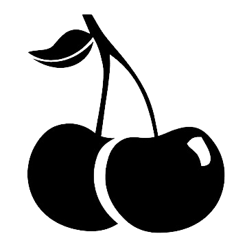

<a name="readme-top">

<br/>

<br />
<div align="center">
  <a href="https://github.com/soleilshane/">
  <!-- TODO: If you want to add logo or banner you can add it here -->
    
  </a>
<!-- TODO: Change Title to the name of the title of your Project -->
  <h3 align="center">Hero and Cards</h3>
</div>
<!-- TODO: Make a short description -->
<div align="center">
  A website project that displays hero and cards with different animation and themes
</div>

<br />

<!-- TODO: Change the zyx-0314 into your github username  -->
<!-- TODO: Change the WD-Template-Project into the same name of your folder -->

https://github.com/soleilshine/WD-Hands-On-2-TC04

---

<br />
<br />

<!-- TODO: If you want to add more layers for your readme -->
<details>
  <summary>Table of Contents</summary>
  <ol>
    <li>
      <a href="#overview">Overview</a>
      <ol>
        <li>
          <a href="#key-components">Key Components</a>
        </li>
        <li>
          <a href="#technology">Technology</a>
        </li>
      </ol>
    </li>
    <li>
      <a href="#rule,-practices-and-principles">Rules, Practices and Principles</a>
    </li>
    <li>
      <a href="#resources">Resources</a>
    </li>
  </ol>
</details>

---

## Overview

<!-- TODO: To be changed -->
<!-- The following are just sample -->
- This project is entitled Hero and Cards with different animation and themes
- The purpose of this project is for Hands on 2 in our Web Design-Lec
- What technology used and how it is used
   1. Waka Time - used to keep track of activity time in projects, ide, os, and language
  2. HTML - used to create and structure content on the web
  3. CSS - used to describe the presentation of a document written in HTML
  4. Background Remover - used to remove a background of an image
  5. CSS Gradient - used to display smooth transitions between two or more specified colors.
  6. Bootstrap - it provides a collection of syntax for template designs.
  7. Google Fonts - makes it easy to bring personality and performance to your websites and products.

### Key Components
<!-- TODO: List of Key Components -->
<!-- The following are just sample -->
- MultiPage Website
- Parallax transition

### Technology
<!-- TODO: List of Technology Used -->


## Rules, Practices and Principles
1. Always use `WD-` in the front of the Title of the Project for the Subject followed by your custom naming.
2. Do not rename any .html files; always use `index.html` as the filename.
3. Place Files in their respective folders.
4. All file naming are in camel case.
   - Camel case is naming format where there is no white space in separation of each words, the first word is in all lower case while the succeding words first letter are in upper followed by lower cased letters.
   - ex.: buttonAnimatedStyle.css
5. Use only `External CSS`.
6. Renaming of Pages folder names are a must, and relates to what it is doing or data it holding.
7. File Structure to follow below.

```
WD-ProjectName
└─ assets
|   └─ css
|   |   └─ style.css
|   └─ img
|   |   └─ fileWith.jpeg/.jpg/.webp/.png
|   └─ js
|       └─ script.js
└─ pages
|  └─ pageName
|     └─ assets
|     |  └─ css
|     |  |  └─ style.css
|     |  └─ img
|     |  |  └─ fileWith.jpeg/.jpg/.webp/.png
|     |  └─ js
|     |     └─ script.js
|     └─ index.html
└─ index.html
└─ readme.md
```

## Resources

<!-- TODO: Add References -->
| Title | Purpose | Link |
|-|-|-|
| Google Fonts | makes it easy to bring personality and performance to your websites and products. | https://fonts.google.com/selection/embed |
| Bootstrap | it provides a collection of syntax for template designs. | https://getbootstrap.com/ |
| Background Remover | used to remove a background of an image. | https://www.remove.bg/upload|
 | MDN Web Docs | used it as a reference for css property. | https://developer.mozilla.org/en-US/|
 | Color Hunt | used it to copy and paste the color code into css. | https://colorhunt.co/|
 | Tim hortons | used it in hero 2 for a logo. | https://1000logos.net/wp-content/uploads/2023/04/Tim-Hortons-Logo-1987.png|
| Design | used it as reference in hero 2 | https://www.youtube.com/watch?v=FBNvpaPaVqY |
 | Hover effects | used it as a reference in card 1 | https://www.youtube.com/watch?app=desktop&v=xGajVWIhzbg&feature=youtu.be|


